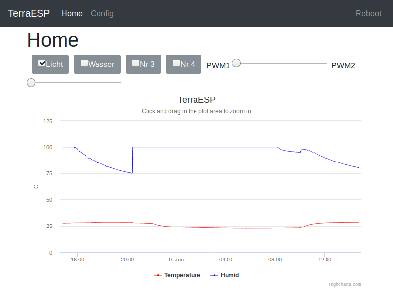
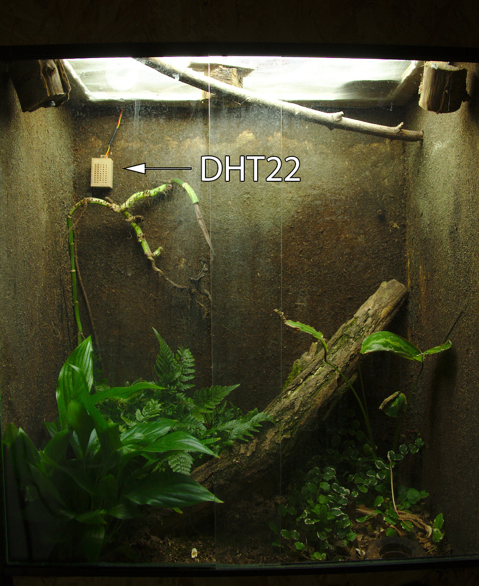
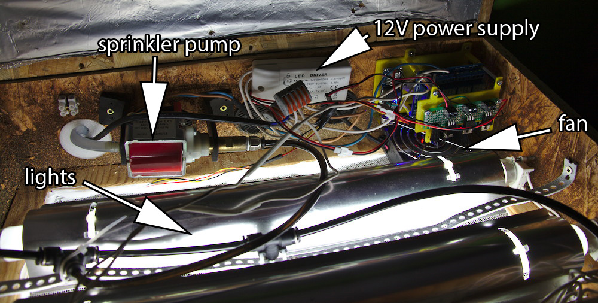
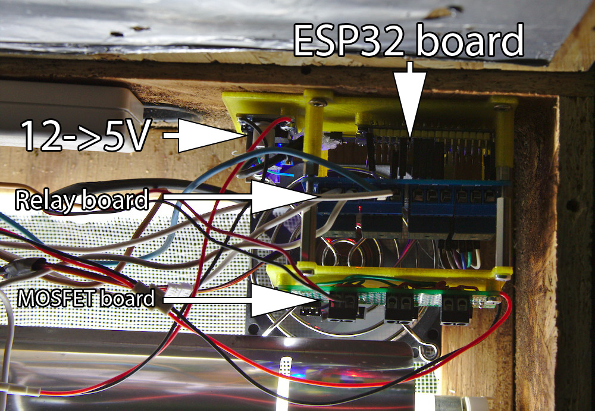

## ESP32 terrarium controller

With this project you can control your terrarium's temperature, light, sprinkler and so on via webinterface.

### Features

* Reads different Sensors for temperature and humidity (DHT22, SHT3x, DS1820, ...) and analog sensors to measure soil moisture etc.
* Timers for day/night light switch
* Actions if threshold for a sensor is reached e.g. to start sprinkler for 10s if humidity is under threshold
* Webinterface:
  * 24h log of temperature and humidity, actions etc.
  * control for buttons/actors and sliders for PWM pins
  * change config
* OTA update via WiFi

### Parts needed

* ESP32 dev board
* DHT22 / SHT31 temperature and humidity senspr
* Relay or SSR board to control lights/pump
* MOSFET board to control LED brightness, fan speed etc. via PWM
* WiFi connection for time sync

The device creates an access point on first start. Then you can configure your WiFi and pin settings.

### Caution

The WiFi password is saved without encryption on the device. Also OTA-update has default password "admin" at the moment. Change it if you want to secure your device for unauthorized updates.

**Make the webinterface accessible from internet is a very bad idea! Please use a VPN or something else to prevent flooded terrariums ;-)**

### Installation

* Download / Clone this repository
* Install PlatformIO: https://docs.platformio.org/en/latest/ide/pioide.html
* Open this project in PlatformIO
* Connect your ESP32 via USB cable and upload sketch and [filesystem](https://docs.platformio.org/en/latest/platforms/espressif32.html#uploading-files-to-file-system-spiffs) (Run task -> Upload file system image)
* Reboot ESP32, it will create an AccessPoint with name ESP_xxxx
* Connect to the AP and open http://192.168.4.1 in Browser
* Connect to your WiFi network
* Setup pins, sensor and so on

### Problems
* If PlatformIO can't find the libraries, switch to the cloned directory, open a terminal and type `pio lib install`. The command should download all necessary libraries.

### ToDo

* new config webpage is in progress...I'm struggling to find the right JS Framework for this Job :D
* webinterface with authorization
* better webinterface for mobile users
* better instructions
* The current hardware setup is a mess  with many jumper cables and so on. So I want to create PCB with relays/SSR, MOSFETS, power supply --> IN PROGRESS (see below)
* PID controller for heater/humidifier?

### PCB

At the moment I'm working on a PCB with several new features:

* 12V supply voltage for board and PWM/switches
* directly soldered ESP32 with 12V -> 5V -> 3V3 converter
* SSR or mechanical relays to switch 230V AC with one 230V AC input and 3-4x outputs
* 2-4x MOSFETs for PWM with supply voltage (to set the brightness of a      12V LED strip or control the speed of a fan)
* Connect multiple sensors/display/whatever via i2c bus

I did a prototype with Fritzing but it lacks some features so I will switch to Eagle.

