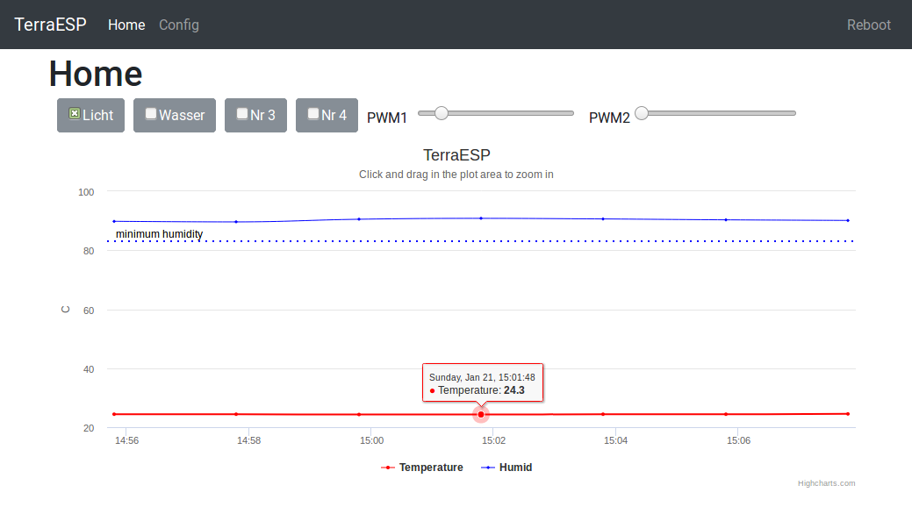

## ESP32 terrarium controller

With this project you can control your terrarium's temperature, light, sprinkler and so on via webinterface.

### Features

* Sensors temperature and humidity
* Timers for day/night light switch
* Starts sprinkler if humidity is under threshold
* Control and 24h log of temperature and humidity via Webinterface
* OTA update via WiFi

### Parts needed

* ESP32 controller
* DHT22 or similar DHT temperature/humidity sensor
* Relays board to control lights/pump
* MOSFET board to control LED brightness, fan speed etc. via PWM
* WiFi connection

The device creates an access point on first start. Then you can configure your WiFi and pin settings.

### Caution

The WiFi password is saved without encryption on the device. 
Everyone in your local network can see it in plain text on your config website.
Also OTA-update has default password "admin" at the moment.
Change it if you want to secure your device for unauthorized updates.

**Make the webinterface accessible from internet is a very bad idea!**

### ToDo:

* make more dynamic config site
* webinterface with authorization
* ...

